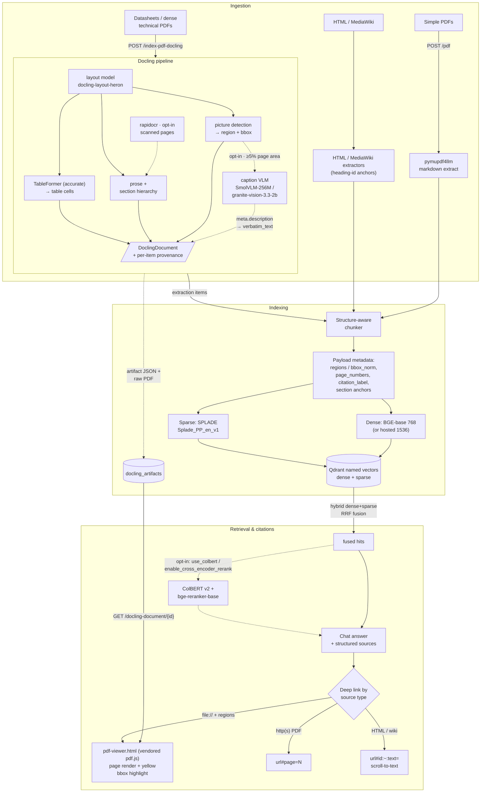

# RAG Indexing and Citation Strategy

How a document becomes searchable chunks, and how an answer links back to the
exact passage it came from. This is both the strategy map and the reference
for the Docling ingestion path (endpoint, configuration, operational notes).



## Deployment configurations and performance

**Why hybrid parsing:** running a VLM over an entire document burns
inference re-reading text that deterministic parsers extract for free.
This pipeline pays VLM cost only on detected picture regions — layout,
tables, and text stay deterministic and cheap.

Model choices for the figure-caption stage:

| | `smolvlm` (default) | `granite` | granite-docling-258M |
|---|---|---|---|
| Model | HuggingFaceTB/SmolVLM-256M-Instruct | ibm-granite/granite-vision-3.3-2b | ibm-granite/granite-docling-258M |
| Role | figure captioning | figure captioning | whole-page parser — *replaces* this pipeline (not used) |
| Weights | ~0.5 GB | ~4–5 GB | ~0.5 GB |
| Fit | built for edge/CPU | richer captions on dense figures; needs GPU | different job |

SmolVLM-256M is default because it is the smallest captioning VLM Docling
ships and the reference deployment is CPU-constrained — on MPS it produces
usable figure captions at ~30–60 s per figure. If captions miss detail you
need (fine axis labels, dense callouts), the setting also accepts **any
HuggingFace repo id**, so a middle step to test is
`PDF_DOCLING_PICTURE_DESCRIPTION_MODEL=HuggingFaceTB/SmolVLM-500M-Instruct`;
`granite` is the heavyweight option when a GPU is available.

| Deployment | Docling device | How |
|---|---|---|
| Docker on macOS | **CPU only** — Apple GPU is unreachable from the Linux VM | default compose stack |
| Docker on Linux + NVIDIA | `cuda` | NVIDIA Container Toolkit + CUDA torch wheels (see CPU vs GPU below) |
| Native host run (Apple Silicon) | `mps` | `PDF_DOCLING_ACCELERATOR_DEVICE=mps`, `QDRANT_HOST=localhost`, `QDRANT_PORT=6335`, `python run.py` from `.venv`; Qdrant stays in Docker |

Measured on a real 13-page MEMS-oscillator datasheet (44 pictures / 14
VLM-eligible at ≥5% page area):

| Path | Time |
|---|---|
| Standard pipeline, container CPU | ~86 s/doc |
| + picture captions, container CPU | ~13 min for a near-full-page figure; ~1–3 h/doc overall |
| + picture captions, native `mps` | ~230 s for a page incl. 5 captions — minutes per doc |

Practical pattern: keep the Docker stack CPU for serving/search, run
figure-heavy indexing batches from a native `mps` process — both write to
the same Qdrant.

**Model memory lifecycle.** Ingestion-only models (Docling layout,
TableFormer, OCR, picture-description VLM) are never used at query time and
are idle-evicted after `INGESTION_MODEL_CACHE_IDLE_TTL_SECONDS` (default
900 s; a background sweeper releases RAM between sporadic indexing runs).
Embedding models (dense/sparse) serve queries and follow
`MODEL_CACHE_IDLE_TTL_SECONDS` (default 300 s). Both settings accept `0`
to keep models resident for the process lifetime. Rebuilding the Docling
converter after eviction costs ~10–60 s of model loads on the next ingest.

## Domain shards (multi-collection domains)

A domain is the **knowledge boundary**; its collections are **pipeline
shards**. A domain declares extra shards and every read/write path
resolves them through one shared service (`backend/services/domain_shards.py`):

```yaml
semiconductor_datasheets:
  collection_name: document_index_semi_ds          # primary shard
  collections:                                     # extra shards, searched together
    - name: document_index_semi_ds_docling_v1
      pipeline: docling
```

Rules:

- **Fan-out read**: search queries every existing shard with the mode its
  vector layout supports (top_k per shard) and merges candidates with RRF.
  All search paths use it — `/search`, chat (new and legacy retrieval),
  and the eval harness. Single-shard domains take the unchanged path.
- **Exclusive write**: a document (matched by its canonical source string)
  lives in only one shard. Indexing a document found in another shard
  refuses without `force_delete`; with it, the new version is indexed and
  the other shard's points are retired — switching pipelines migrates.
- **Lazy creation**: declared shards are created on first index; search
  skips shards that don't exist yet.
- **Admin ops** (delete by URL/base-url, document listings) span the shard
  set and report per-collection counts.

## 1. Ingestion paths (routing by document type)

| Document type | Endpoint | Extractor | Why |
|---|---|---|---|
| Simple PDFs — headings, prose, simple tables | `POST /pdf` | pymupdf4llm (+ PyMuPDF fallback) | Fast markdown extraction; cheap; adequate when layout/table structure is simple |
| Datasheets & dense technical PDFs — multicolumn, complex tables, figures, footnotes | `POST /index-pdf-docling` | Docling (layout analysis + TableFormer) | Preserves table structure, section hierarchy, and per-item bounding-box provenance |
| HTML pages | HTML ingestion route | `html_extractor.py` | DOM-aware; heading `id`s become `#section` anchors in chunk URLs |
| MediaWiki pages | MediaWiki ingestion route | `mediawiki_extractor.py` | Same anchor behavior via section URLs |

Models used per stage (full inventory):

| Stage | Model | Purpose |
|---|---|---|
| Layout detection | `docling-layout-heron` | Finds prose, tables, pictures, sections with boxes |
| Table structure | TableFormer (`accurate` default) | Deterministic cell extraction for spec tables |
| OCR | rapidocr (opt-in, `PDF_DOCLING_DO_OCR`) | Scanned/image-only pages |
| Figure captions | `SmolVLM-256M-Instruct` or `granite-vision-3.3-2b` or any HF repo id (opt-in, `PDF_DOCLING_PICTURE_DESCRIPTION*`) | Turns detected picture regions into searchable text |
| Dense embedding | `BAAI/bge-base-en-v1.5` 768-dim (or hosted 1536) | Semantic similarity |
| Sparse embedding | `prithivida/Splade_PP_en_v1` | Learned lexical match — part numbers, units, test conditions |
| Late interaction | `colbert-ir/colbertv2.0` (opt-in, `use_colbert`) | Token-level precision for symbols/part numbers |
| Reranker | `BAAI/bge-reranker-base` (opt-in, `enable_cross_encoder_rerank`) | Cross-encoder rescore of fused hits |
| Answer generation | hosted LLM (OpenAI / Gemini per env keys) | Synthesizes the cited answer |

Local models are defined in `prompts/local_models_registry.yaml` (dense,
sparse, late-interaction, reranker tiers); Docling-stage models come from
Docling's pinned pipeline presets.

Notes:

- The Docling path is **additive** — it writes a dedicated collection
  (`*_docling_v1`) and never touches legacy collections.
- Docling persists both an extraction artifact (JSON with full provenance)
  and the raw PDF beside it, which powers served citations later.
- **Opt-in figure enrichment**: `PDF_DOCLING_PICTURE_DESCRIPTION` sends each
  detected picture region to a captioning VLM (SmolVLM-256M default,
  granite-vision-3.3-2b optional); the generated text becomes searchable
  caption chunks with the figure's provenance intact. Off by default —
  it adds a model download and per-figure inference at index time.
- **Future option** (deferred): ColPali-style visual retrieval over page
  images. The payload/`regions` plumbing already supports it.

## 2. Indexing and metadata

**Chunking** (per path):

- Legacy PDF: markdown-aware section chunks.
- Docling: structure-aware chunks — prose sentence packing with section
  breadcrumbs, table row groups with repeated headers, plus row-level
  key/value chunks for large tables. Figure descriptions (when the VLM
  stage is enabled) become `caption` chunks bound to the figure region.
- HTML/wiki: section-scoped chunks keyed by heading anchors.

**Key payload fields** (citation-critical):

- `document_id`, `source`/`url`, `title`, `section`, `section_path`
- `regions` — per-item `{page_number, bbox_norm}` where `bbox_norm` is the
  normalized `[x0, y0, x1, y1]` rectangle on the page
- `page_numbers`, `citation_label`, `artifact_uri`

**Vectors:**

- Dense: `BAAI/bge-base-en-v1.5` (768-dim, local) or hosted (OpenAI/Gemini,
  1536-dim) — semantic similarity
- Sparse: `prithivida/Splade_PP_en_v1` (local SPLADE) — learned lexical
  matching; catches part numbers, units, and exact test conditions that
  dense vectors blur
- Named-vector layout (`dense` + `sparse`) with **domain profiles**:
  `legacy-dense`, `hosted-dense`, `local-dense`, `hosted-hybrid`,
  `local-hybrid` — see `prompts/domain_embedding_config.yaml`

**Idempotency:** stable point IDs derived from
`(domain, pipeline_version, source_key, chunk_id)`; re-indexing replaces
points transactionally, so re-ingesting a doc never duplicates.

## 3. Search and citations

**Retrieval:** hybrid dense + sparse fused with Reciprocal Rank Fusion
(`search_mode: hybrid` on hybrid domains). Domain selection routes to the
right collection — e.g. `semiconductor_datasheets_docling` searches the
Docling collection.

**Citations:** chat responses carry a structured `sources` array (full
payloads). The UI renders a clickable list and the redundant plain-text
"Sources:" tail is stripped.

**Deep-link matrix:**

| Source | Link built | Lands on |
|---|---|---|
| `file://` PDF + `regions` | `/pdf-viewer.html?doc=…&page=N&bbox=x0,y0,x1,y1` | Vendored pdf.js viewer renders the page and draws the cited region (yellow box) |
| `file://` PDF, no regions | `/docling-document/{id}#page=N` | Raw PDF at cited page |
| `http(s)` PDF | `url#page=N` | Browser PDF viewer at page |
| `http(s)` HTML/wiki | `url[#id]:~:text=…` | Scroll-to-text fragment: whole chunk ≤8 words, else first-4..last-4 word range; heading `id` anchor preserved |

Text fragments are computed at render time from `payload.text` — they work
on already-indexed documents with no reindex. `file://` links require the
PDF persisted at index time, so documents indexed before persistence must
be re-indexed (no fallback paths).

## 4. Decision guide for a new corpus

- Plain reports/articles with headings and simple tables → `/pdf` + a
  `hosted-dense` or `local-dense` domain.
- Datasheets, spec docs, anything where table cells/figures/units matter →
  `/index-pdf-docling` + `local-hybrid` (SPLADE catches exact part numbers).
- HTML/wiki corpora → standard ingestion; deep links come free from
  heading anchors + text fragments.
- Re-indexing a corpus? Use the same domain/pipeline so stable IDs swap
  points cleanly; migrate legacy collections off `legacy-dense` only when
  re-indexing anyway.

# Docling pipeline reference

`POST /index-pdf-docling` is an **additive** ingestion path for technical
PDFs — datasheets with part numbers, specification tables, footnotes, and
multicolumn layouts. It runs alongside `POST /pdf` and never changes it:
the legacy route, its extractor, and its collections are untouched.

The pipeline is built on [Docling](https://docling-project.github.io/docling/)
and records citation-grade provenance for every indexed chunk: the source
item reference, page number, and a normalized bounding box suitable for
viewer overlays.

## When to use it

- Use `POST /pdf` for general documents (existing behavior).
- Use `POST /index-pdf-docling` for technical/datasheet PDFs where table
  structure, part-number lookup, and precise citation regions matter.

In the **Web UI** (Index PDF tab), check **Use Docling pipeline** before
clicking *Index PDF* — the same form then submits to `/index-pdf-docling`
with the selected domain, estimate, force-delete, max-chunks, and
skip-sections settings. Unchecked, the form keeps using the legacy `/pdf`
pipeline.

## How it works

See the diagram above — inside the Docling box, the layout model feeds
prose, TableFormer, and picture detection; the optional VLM captions
picture regions; everything lands in a typed extraction artifact saved
outside Qdrant, then chunked, embedded, and upserted to
`<domain_collection>_docling_v1`.

Key properties:

- **Isolated collection.** Points are written to a dedicated versioned
  collection (`<domain_collection>_docling_v1`, e.g.
  `document_index_semiconductor_datasheets_docling_v1`). Legacy `/pdf`
  points are never read or written by this path.
- **Stable IDs.** `document_id = sha256(PDF bytes)`; point IDs derive
  deterministically from `(domain, pipeline_version, source_key,
  document_id, chunk)`. Re-indexing overwrites points instead of
  duplicating them, and stale points from a smaller replacement are retired
  only after the new version is upserted.
- **Structure-aware chunks.** Prose is split within sections with a title +
  section breadcrumb prefix on the embedded text; `display_text` stays
  verbatim. Small tables stay intact; large tables split into row groups
  with repeated headers, plus a row-level key/value representation
  (`representation_type=row_kv`) for exact parameter/value lookup.
- **Provenance.** Every chunk carries `item_refs`, `page_numbers`, and
  normalized `regions` (`[x0, y0, x1, y1]`, top-left origin, fractions of
  page width/height). Items without a trustworthy box are indexed with
  `highlight_status=unavailable` rather than a fabricated region.
- **No silent fallback.** If Docling conversion fails, the route returns a
  visible error (`422`). It never degrades to the legacy parser.
- **Artifacts.** The full extraction artifact (items, table cells, raw
  boxes) is serialized to `docling_artifacts/` with a checksum and referenced
  by `artifact_uri` from each point, keeping citation geometry tied to the
  exact indexed bytes.

## Request

Same shape as `POST /pdf`:

```json
{
  "url": "https://example.com/part.pdf",
  "file": "<base64 PDF bytes — overrides url bytes, url stays canonical>",
  "filename": "part.pdf",
  "active_domain": "semiconductor_datasheets",
  "estimate": false,
  "force_delete": false,
  "max_chunks": 0,
  "skip_sections": []
}
```

- `estimate=true` runs extraction and chunk planning only — no Qdrant or
  artifact writes.
- `force_delete=true` re-indexes this pipeline's points for the document.
  Without it, an already-indexed document returns an `already_indexed`
  confirmation instead of writing.
- `max_chunks` truncates and reports `chunks_omitted_by_max_chunks`.
- `skip_sections` matches normalized heading paths (default: none).

**Live progress (SSE).** `POST /index-pdf-docling/stream` runs the same
pipeline but streams `text/event-stream` frames as it goes, so the UI can
show where the time is actually spent during a cold start:

```text
event: stage
data: {"message": "Loading model: docling-layout-heron, TableFormer (accurate), HuggingFaceTB/SmolVLM-256M-Instruct"}

event: stage
data: {"message": "Extracting document (Docling layout analysis)..."}

event: stage
data: {"message": "Indexing 48 chunks into Qdrant..."}

event: result
data: {...same payload as POST /index-pdf-docling...}
```

The model-loading stage is emitted **only on a cold converter build**
(first index, or after `INGESTION_MODEL_CACHE_IDLE_TTL_SECONDS` eviction);
warm runs skip straight to extraction. Failures arrive as
`event: error` with a `detail` field. The plain endpoint is unchanged for
non-streaming clients.

## Response

```json
{
  "message": "PDF indexed via Docling pipeline",
  "pipeline": "pdf_docling_v1",
  "pipeline_version": "1.0",
  "source": "https://example.com/part.pdf",
  "document_id": "sha256:...",
  "title": "...",
  "page_count": 12,
  "collection": "document_index_semiconductor_datasheets_docling_v1",
  "chunks_indexed": 48,
  "chunks_omitted_by_max_chunks": 0,
  "stale_points_deleted": 0,
  "tokens_used": 15230,
  "embedding_cost": 0.0015230,
  "parsing_warnings": [],
  "provenance_coverage": 0.97,
  "artifact_uri": "internal://documents/sha256:..."
}
```

`provenance_coverage` is the fraction of extracted items with a valid
highlight region. `parsing_warnings` surfaces Docling conversion errors and
missing provenance for tables/sections.

## Point payload (allowlisted)

Each Qdrant point stores: `pipeline`, `pipeline_version`, `domain`,
`source_key`, `document_id`, `source`/`url`/`url_lower`/`base_url`/
`base_url_lower`, `document_type`, `title`, `section`, `subsection`,
`section_path`, `chunk_id`, `chunk_index`, `total_chunks`, `block_type`,
`representation_type`, `text` (embedded text), `display_text`,
`item_refs`, `regions`, `page_numbers`, `highlight_status`,
`citation_label`, `artifact_uri`, `embedding_model`/`provider`/`runtime`,
and `token_count`.

## Configuration

Settings (see `.env.example`):

| Setting | Default | Purpose |
|---|---|---|
| `PDF_DOCLING_ENABLED` | `true` | Feature gate for the route. |
| `PDF_DOCLING_WARMUP_ON_STARTUP` | `true` | Pre-download Docling models in a background task after startup. |
| `PDF_DOCLING_ARTIFACT_DIR` | `docling_artifacts` | Extraction artifact store. |
| `PDF_DOCLING_CHUNK_SIZE` | `500` | Embedding token budget per chunk. |
| `PDF_DOCLING_CHUNK_OVERLAP` | `50` | Prose overlap tokens. |
| `PDF_DOCLING_TABLE_ROWS_PER_CHUNK` | `12` | Data rows per table row-group chunk. |
| `PDF_DOCLING_MIN_ROWS_ROW_REPR` | `8` | Tables with more data rows also get `row_kv` chunks. |
| `PDF_DOCLING_COLLECTION_SUFFIX` | `_docling_v1` | Dedicated collection suffix. |
| `PDF_DOCLING_DO_OCR` | `false` | Enable Docling OCR (rapidocr) for scanned pages. |
| `PDF_DOCLING_TABLE_MODE` | `accurate` | Docling TableFormer mode (`fast` or `accurate`). |
| `PDF_DOCLING_ACCELERATOR_DEVICE` | `auto` | Inference device: `auto`, `cpu`, `mps`, `cuda`, `cuda:N`, `xpu`. |
| `PDF_DOCLING_NUM_THREADS` | `4` | CPU threads for Docling model inference. |
| `PDF_DOCLING_PICTURE_DESCRIPTION` | `false` | Send detected picture regions to a captioning VLM so figure content is indexed as searchable caption chunks. |
| `PDF_DOCLING_PICTURE_DESCRIPTION_MODEL` | `smolvlm` | Captioning VLM: `smolvlm`, `granite`, or any HuggingFace repo id (e.g. `HuggingFaceTB/SmolVLM-500M-Instruct`). |
| `PDF_DOCLING_IMAGES_SCALE` | `1.0` | Render scale for generated page/picture bitmaps (1.0 = 72 DPI). VLM crop resolution = this × the preset's 2.0; use `2.0` when figure micro-text must be legible to the VLM. Higher values cost memory + per-figure inference. |

### Configuration recipes

Why these knobs exist and when to combine them:

| Scenario | Settings | Why |
|---|---|---|
| Default serving (container, CPU) | *(defaults — nothing set)* | Standard extraction only; no VLM download or per-figure cost. Right for everyday indexing/search. |
| Figure-rich datasheets on Apple Silicon | `PDF_DOCLING_PICTURE_DESCRIPTION=true`, `PDF_DOCLING_IMAGES_SCALE=2.0`, run with `PDF_DOCLING_ACCELERATOR_DEVICE=mps python run.py` natively | Figure content becomes searchable; `mps` only reaches the GPU outside Docker; scale 2.0 makes micro-text (package dims, tolerances) legible to the VLM. |
| Figure captions on Linux+NVIDIA | `PDF_DOCLING_ACCELERATOR_DEVICE=cuda` (+ CUDA torch wheels); optionally `..._MODEL=granite` | GPU container path; granite's larger VLM earns its cost when figures are dense and a GPU is present. |
| Scanned / image-only PDFs | `PDF_DOCLING_DO_OCR=true` | rapidocr OCR kicks in for pages with no text layer. |
| Tuning cost vs coverage | `PDF_DOCLING_TABLE_MODE=fast`, `PDF_DOCLING_NUM_THREADS`, `PDF_DOCLING_WARMUP_ON_STARTUP=false` | `fast` trades table accuracy for speed; threads bound CPU inference; disabling warmup defers model download to first request. |

`.env` feeds the container via `env_file` and host runs via pydantic
settings — the same file serves both; use shell env vars (which beat
`.env`) to scope GPU settings to native runs only.

### Picture description behavior

When enabled, the standard pipeline stays in charge of layout and tables;
the VLM only captions `picture` items. Notes:

- Pictures under **5% of the page area** are skipped (Docling's
  `picture_area_threshold`), which filters logos/icons but also small
  figures.
- `PDF_DOCLING_IMAGES_SCALE=2.0` is recommended for micro-detail
  datasheets: measured on land-pattern/package figures in a real
  datasheet, 288-DPI crops surfaced tolerance callouts (`0.55+0.05`,
  drawing revision labels) that 144-DPI crops missed entirely. Negligible
  extra cost on `mps`.
- Generated text lands in the picture's `verbatim_text` and is chunked as a
  `caption` block carrying the figure's `item_refs`/`regions`, so citations
  still deep-link to the exact figure box.
- **CPU cost is real** — see the measured performance table above; on
  CPU-only deployments index selectively or accept hours per
  picture-heavy doc.
- VLM text is a description, not extraction — do not rely on it for exact
  numeric values in tables; TableFormer remains the authority there.

## CPU vs GPU

Two independent knobs control whether Docling uses CPU or GPU:

**1. Runtime device** (`PDF_DOCLING_ACCELERATOR_DEVICE`) selects the inference
device per conversion, regardless of which PyTorch build is installed:

- `auto` (default) — best available (CUDA on NVIDIA Linux, MPS on Apple
  Silicon, CPU otherwise)
- `cpu` — force CPU; avoids GPU/accelerator initialization entirely
- `mps` / `cuda` / `cuda:N` / `xpu` — pin a specific accelerator

`PDF_DOCLING_NUM_THREADS` bounds CPU inference threads (relevant in `cpu`
mode and for CPU-side ops). Both apply only to the Docling pipeline; nothing
else in the app is affected.

**2. Install-time PyTorch build (CPU by default).** `requirements.txt`
resolves PyTorch from the CPU-only wheel index
(`https://download.pytorch.org/whl/cpu`). The CPU wheels carry a `+cpu`
local version (e.g. `2.14.0+cpu`), which pip ranks above the plain PyPI
build, so `torch`/`torchvision` resolve to the CPU variant and the
`nvidia-*` packages are skipped entirely (~200 MB instead of ~4 GB on
Linux; macOS is CPU-only either way). `requirements.lock` (used by CI and
the Docker image) is generated from `requirements.txt` and inherits the
same CPU-only resolution.

To use an NVIDIA GPU despite the CPU default, reinstall the CUDA build
after installing requirements:

```bash
pip install --force-reinstall torch torchvision \
  --index-url https://download.pytorch.org/whl/cu126   # or your CUDA variant
```

and set `PDF_DOCLING_ACCELERATOR_DEVICE=auto` or `cuda`.

> **macOS note:** `requirements.lock` pins Linux CPU wheels
> (`torch==...+cpu`), so install on macOS from `requirements.txt` (unpinned)
> rather than the lock.

## Operational notes

- **Dependencies.** Docling (pinned in `requirements.txt`) pulls the
  torch stack; the dependency lock reflects this. First conversion on a
  machine downloads Docling model artifacts into the HuggingFace cache.
  When `PDF_DOCLING_WARMUP_ON_STARTUP` is true (default), a background
  task builds the converter after app startup so the first request is
  fast; in Docker, `HF_HOME=/root/models/huggingface` lands those
  downloads inside the persisted `LOCAL_MODELS_CACHE_PATH` volume so
  container recreation does not re-download them.
- **Host access to Qdrant.** When running the app on the host (not in
  Docker), set `QDRANT_PORT=6335` per `docker-compose.yml`.
- **CI.** Unit tests run without Docling model inference (programmatic
  `DoclingDocument` fixtures). The end-to-end conversion test is opt-in via
  `RUN_DOCLING_E2E=1`.

## Limitations and next steps

- Validated against a synthetic datasheet fixture (drawn table, headings,
  prose). **Geometry and table quality must be re-validated on real
  datasheet PDFs before production use** — the fixture cannot establish
  scanning, rotation, or multi-column quality.
- Retrieval is live on the sharded path: `/search`, chat, and the eval
  harness fan out across the domain's existing shards and merge candidates
  with RRF; `local-hybrid` domains run dense + sparse fusion per shard.
  What remains deferred is retrieval tuning / reranker evaluation against
  a real datasheet eval set (spec stage 4, tracked in `PDF_DOCLING_TASKS.md`).
- VLM figure descriptions are implemented but off by default
  (`PDF_DOCLING_PICTURE_DESCRIPTION`); validate against the retrieval eval
  harness before enabling broadly. ColPali visual retrieval remains a later
  experiment.

## References

- `prompts/domain_embedding_config.yaml` — domain profiles and validation
  rules (header comment)
- [README — Domain configuration](README.md) — profile matrix and when to
  use each
- [Retrieval evaluations usage guide](retrieval-evaluations-usage-guide.md)
  — A/B pipeline comparison harness
- `PDF_DOCLING_TASKS.md` — implementation work log
