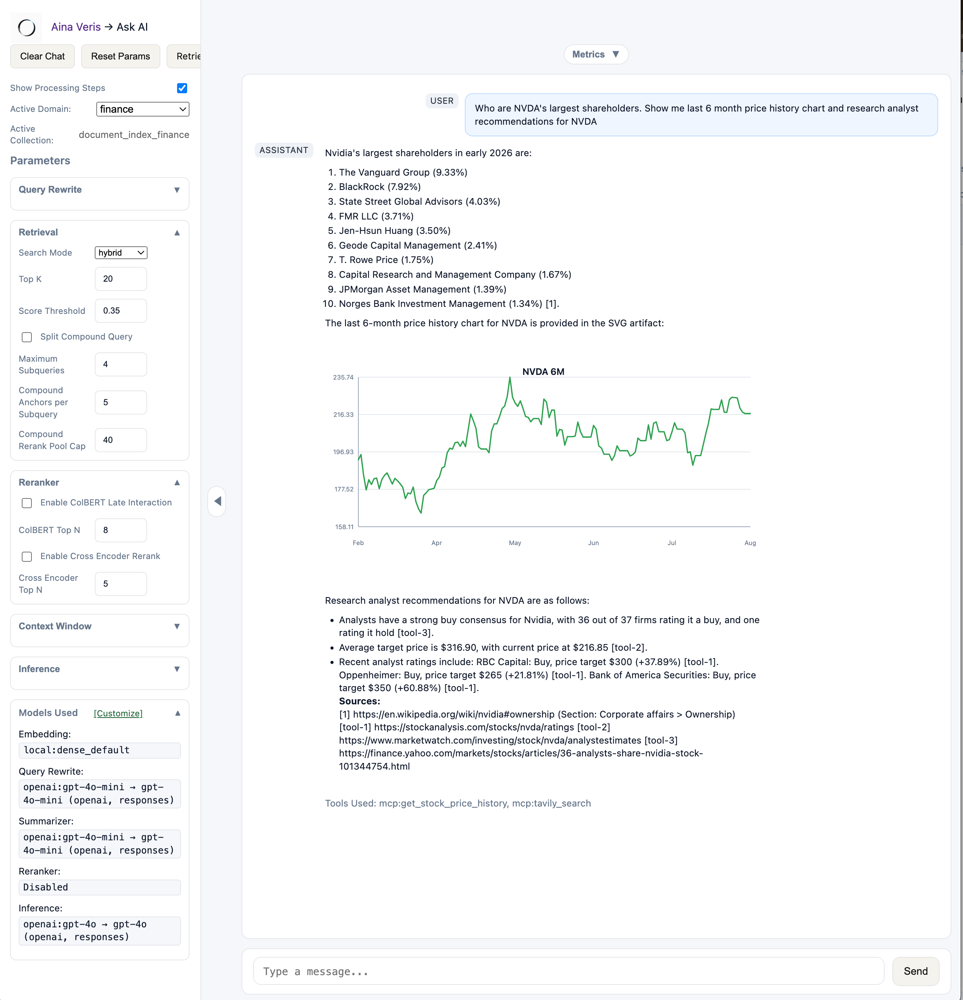
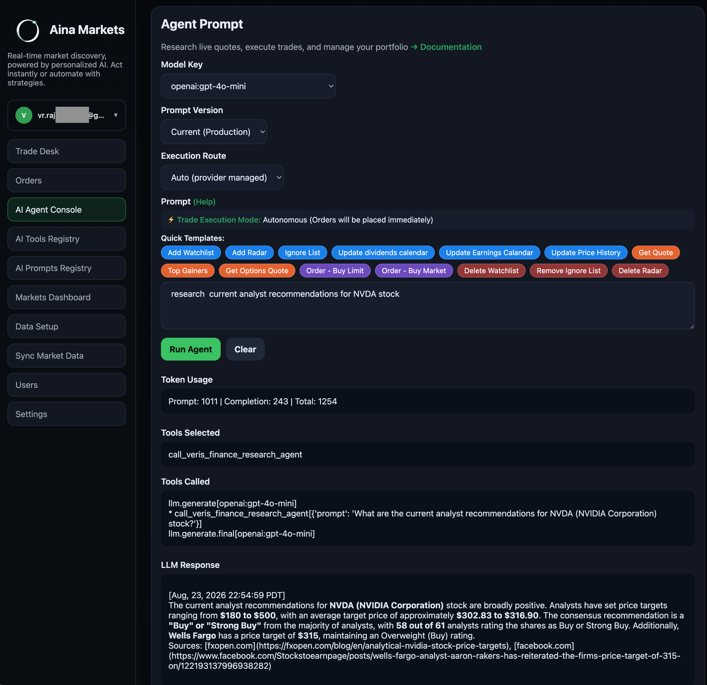
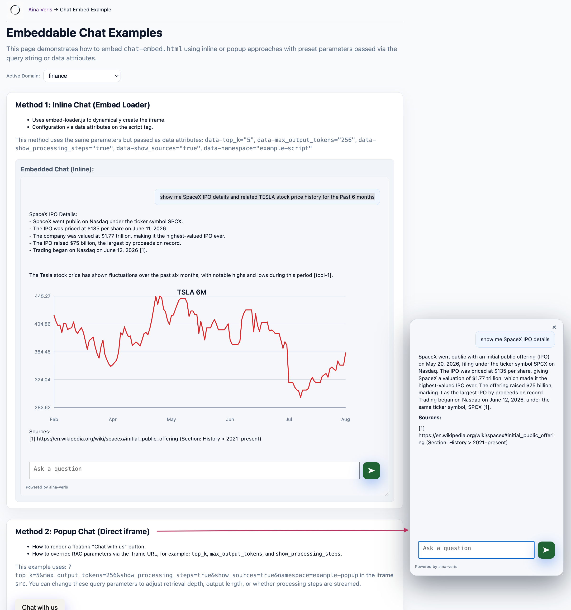
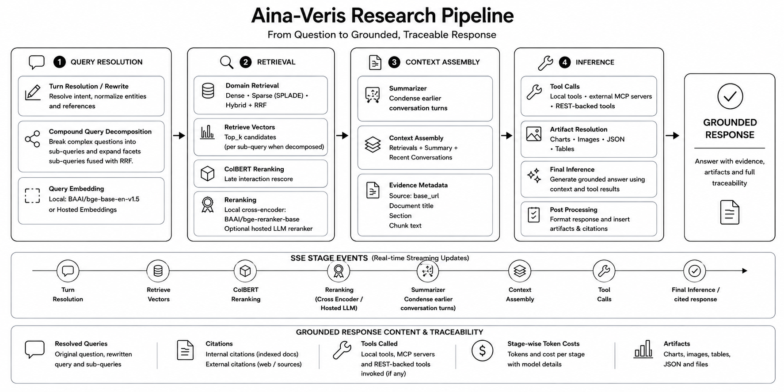
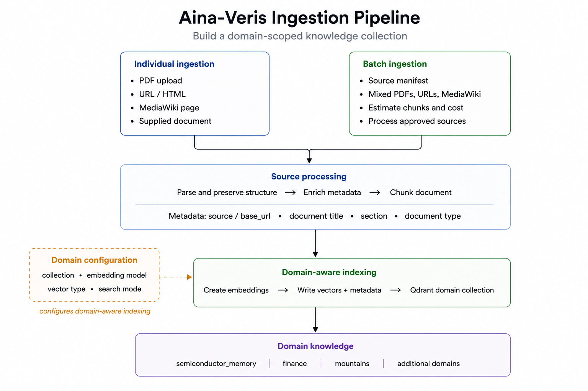
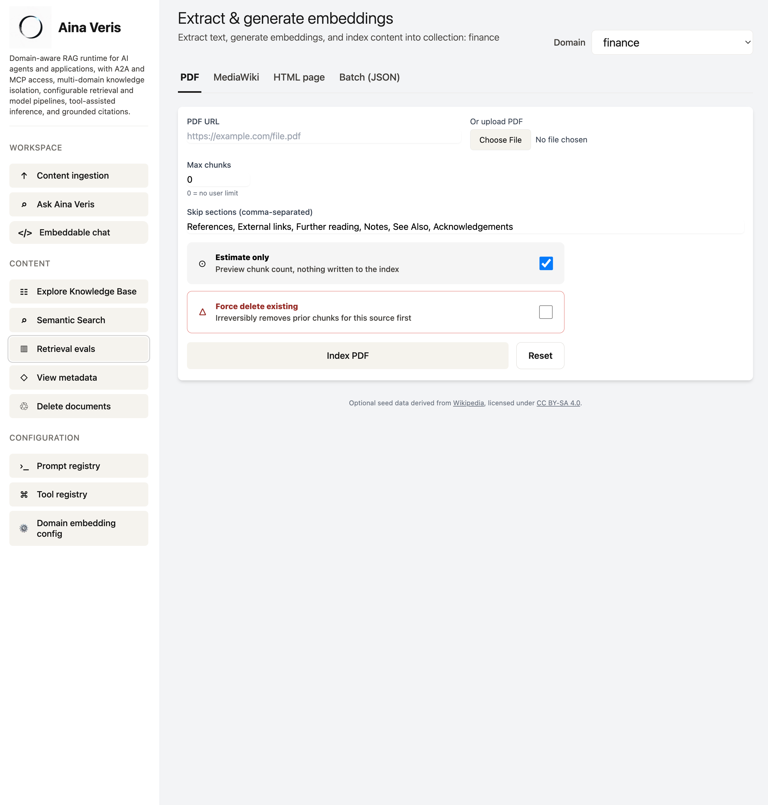
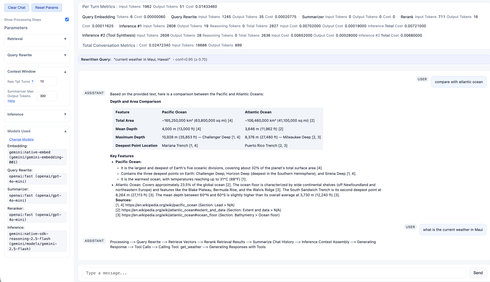
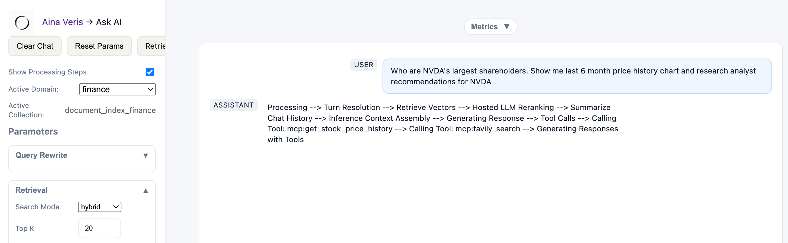
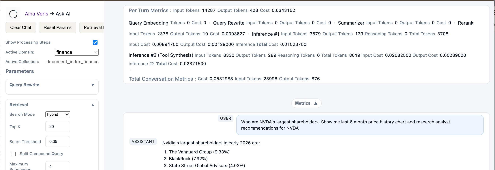
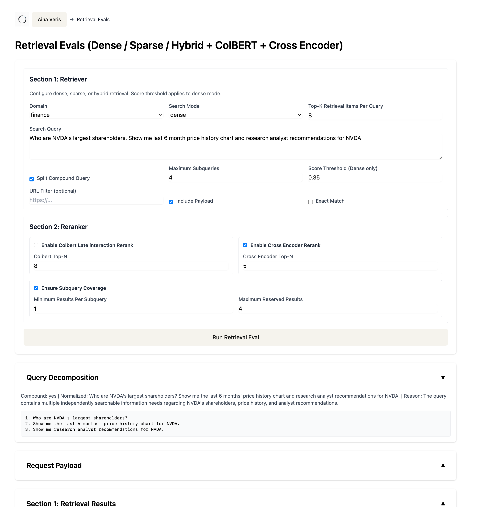

# Aina-Veris

[](LICENSE)
[](https://www.python.org/downloads/)
[](https://qdrant.tech/)

**Domain-Aware Research with A2A, MCP, and Configurable Retrieval**

Aina-Veris combines domain-specific knowledge with configurable retrieval,
tools, models, and prompts in a shared research runtime for **AI agents and
applications**.

[Install Aina-Veris →](#quick-start)

## Aina-Veris Through Claude

Claude can use Aina-Veris through the **Model Context Protocol (MCP)** to
discover and call domain-scoped research tools. The included reference tools
research Mountains, Finance, and Semiconductor Memory through the same
retrieval, reranking, tool-calling, and grounded-synthesis runtime used by the
web application and REST API.

After connecting Claude Desktop, try:

> “Research NVDA's largest shareholders, recent price history, and analyst
> recommendations.”

> “What does the Semiconductor Memory research agent know about DDR5 power
> management?”

> “Research the best time to hike Mount Whitney and cite your sources.”

Claude and other MCP-compatible AI agents can **discover → research → cite**
with Aina-Veris. For local Claude Desktop setup, see
[Connect Aina-Veris to Claude Desktop via MCP](#connect-aina-veris-to-claude-desktop-via-mcp).

## Research in Action

**These examples show Aina-Veris performing tool-assisted, domain-grounded
research and providing research capabilities to another application through
A2A.**

### Tool-Assisted Domain Research

> **"Who are NVDA's largest shareholders? Show me a 6-month price-history
> chart and research current analyst recommendations for NVDA."**

This request combines:

- **Domain knowledge retrieval** from the indexed Finance knowledge base.
- **MCP tool access** for structured market data used to generate the
  price-history chart. The returned time-series data is rendered to SVG using
  [`timeseries-sparklines`](https://pypi.org/project/timeseries-sparklines/)
  and inserted into the response as an artifact during post-processing.
- **External research through MCP** for current analyst recommendations.
- **Grounded synthesis** with citations, source metadata, and generated
  artifacts.

<p align="center">
  
</p>

The tools used in this example—`get_stock_price_history` and
`tavily_search`—are visible alongside the response. The Web UI also surfaces
pipeline metrics including **latency, token usage, and inference cost**.

### A2A — Aina-Veris as a Research Provider

<p align="center">
  
</p>

In this example, **Aina Markets** uses Aina-Veris as its **Finance-domain A2A
research agent**. The application calls the agent to perform domain-scoped
research through the Aina-Veris shared research runtime.

### Embeddable Chat

Aina-Veris research can also be embedded directly into applications using
**inline or popup chat**.

Embedded chat uses the same domain-aware research runtime, including
**knowledge retrieval, MCP and local tool calling, grounded citations,
generated artifacts, and streaming responses**.

<p align="center">
  <a href="images/embeddable-chat.png">
    
  </a>
</p>

<p align="center">
  <em>Inline and popup embedding options. Click to view full size.</em>
</p>

## Shared Runtime, Different Research Domains

Each domain maintains its own **knowledge collection, embedding configuration,
retrieval strategy, prompts, and model configuration** while using the same
research pipeline and integration surfaces.

Aina-Veris research capabilities can be accessed through **A2A, MCP,
REST/OpenAPI, the Web UI, and embeddable chat**.

Domain, model, prompt, and tool behavior is managed through **versioned YAML
registries**, with global prompts supporting **domain-specific overrides at
individual pipeline stages**.

## System Architecture

<p align="center">
  
</p>

> **Deployment security:** Aina-Veris defines the security boundary but does
> not provide a built-in identity or authorization system. See
> [Security](SECURITY.md) for authentication and public
> endpoint guidance.

Aina-Veris separates the interfaces used to invoke research from the runtime that executes it.

- **Domain-isolated knowledge** — each domain can use its own Qdrant collection, embedding configuration, prompts, and retrieval policy.
- **Multiple integration surfaces** — A2A, MCP, REST, SSE, and embeddable chat use the shared research runtime.
- **Balanced answers to multi-part questions** — optional query splitting and retrieval controls help prevent one part of a question from overshadowing the rest.
- **Tool-assisted inference** — local tools, external MCP servers, and REST-backed capabilities can participate in research.
- **Traceable execution** — citations, resolved queries, artifacts, SSE stages, token usage, and stage latency remain observable through the pipeline.

## Research Pipeline

A research request moves through four major stages:

**Query Resolution → Retrieval → Context Assembly → Inference**

<p align="center">
  
</p>

The pipeline preserves more than the final answer. A completed request can carry its resolved queries, internal and external citations, tools invoked, generated artifacts, and stage-level token and cost information.

SSE stage events provide real-time visibility while the pipeline is running.

### Better coverage for multi-part questions

When someone asks several things at once, Aina-Veris can break the request into
smaller questions before finding evidence. This helps the final answer stay
useful across the whole request.

- **Break down the question** — turn a complex request into focused research
  questions when needed.
- **Find evidence for each part** — search and rank results separately instead
  of letting one topic take over.
- **Build a more balanced answer** — combine the strongest evidence while
  keeping distinct parts of the request represented.

These retrieval and reranking options are configurable, so simpler questions
can use a faster path.

## Building a Domain Knowledge Base

Bring a domain's source material into Aina-Veris so agents and applications can
retrieve it as cited evidence. Index individual PDFs, URLs, MediaWiki pages, or
application-supplied documents; use batch ingestion to plan and process larger
source sets. The domain configuration determines the collection, embedding
path, and retrieval policy used once that knowledge base is queried.

<p align="center">
  
</p>

The same domain-aware workflow is available through the **Aina-Veris Web UI**,
with ingestion for PDF, MediaWiki, HTML, and batch sources. The workspace also
provides access to knowledge-base exploration and management, semantic search,
retrieval evaluation, and the **prompt, tool, and domain embedding
registries**.

- **Individual or batch sources** — Index a document directly or process a
  source manifest after estimating chunks and cost.
- **Evidence-preserving processing** — Retain source, document title, section,
  and document-type metadata while parsing and chunking content.
- **Domain-aware indexing** — The domain configuration selects the collection,
  embedding model, vector type, and retrieval path for the resulting knowledge
  base.

<p align="center">
  
</p>

### Individual ingestion

The ingestion endpoints accept different source shapes but feed one pipeline:
parse the source, preserve useful metadata, chunk the content, create the
configured vectors, and store them in the selected domain collection.

| Source | Endpoint | Use |
|---|---|---|
| URL or HTML | `POST /index` | Index a web page or fetched document. |
| Uploaded PDF | `POST /pdf` | Parse and index a PDF. |
| MediaWiki page | `POST /mediawiki/url` | Retrieve and index a MediaWiki article. |
| Supplied document | `POST /embed` | Index content provided directly by an application. |

### Batch ingestion

For repeatable corpus work, `scripts/batch/process_docs.py` reads an input
file such as `scripts/batch/input/sample_batch_input.json`. Its estimate mode
plans chunks and cost before indexing; run it with `--no-estimate` only when
ready to process the sources.

### Domain configuration

A **domain** keeps a knowledge base and its retrieval policy together. Its
definition in `prompts/domain_embedding_config.yaml` names the Qdrant
collection, embedding model, vector type, and search mode. Prompt instructions
inherit global research and citation rules, with optional domain-specific
overrides in `prompts/prompt_registry.yaml`.

Changing an embedding model, vector shape, chunking policy, or collection
requires re-indexing the affected corpus.

### Publish a domain to A2A and MCP

REST and browser callers select a domain with `active_domain`. To publish a
domain as a callable research capability for agents and external applications,
add a `VerisA2AAgent` entry to `VERIS_A2A_AGENTS` in `backend/a2a/config.py`.
Set its stable `name`, fixed `domain`, description, and capability IDs, then
set `A2A_VERIS_PUBLIC_BASE_URL` and restart the service.

An A2A or MCP research agent does not accept a caller-selected domain; its
configured domain is fixed by the server.

Each configured agent produces an AgentCard, A2A task endpoint, and
domain-scoped MCP research tool:

```text
GET  /agents/<agent-name>/.well-known/agent-card.json
POST /agents/<agent-name>/
```

AgentCards are generated routes, not physical JSON files. Publishing a
canonical root `/.well-known/agent-card.json` endpoint is a separate routing
decision for a primary public agent.

## Core Capabilities

### Domain-scoped A2A research agents

Aina-Veris exposes domain-scoped agents through the **Agent-to-Agent (A2A)** protocol. Another application discovers an agent through its AgentCard, sends a research task over JSON-RPC, and receives a Markdown research artifact with sources.

Each agent owns a fixed knowledge domain. Callers provide the question while Aina-Veris retains control of the collection, embedding model, prompts, retrieval policy, tool limits, and output constraints.

```text
External AI system
  → discovers Veris AgentCard
  → calls a domain-specific A2A research agent
  → Veris applies the agent's fixed domain and pipeline policy
  → retrieval, reranking, tools, and synthesis
  → Markdown research artifact + optional source metadata
```

[Explore the A2A integration →](README_A2A.md)

### REST and SSE interfaces

The FastAPI service exposes the shared chat and retrieval implementation to external applications through REST endpoints and OpenAPI.

| Interface | Endpoints | Function |
|---|---|---|
| **Stateless chat** | `POST /chat` | Caller supplies the message, optional history, and pipeline parameters. |
| **Session chat** | `POST /chat/session`, `POST /chat/{session_id}` | Veris keeps server-side conversation history for the session. |
| **Vector search** | `POST /search` | Runs direct dense, sparse, or hybrid retrieval without answer generation. |
| **Ingestion** | `POST /index`, `POST /pdf`, `POST /mediawiki/url`, `POST /embed` | Indexes URLs, PDFs, MediaWiki content, or a supplied document in the selected domain. |
| **Retrieval evaluation** | `POST /retrieval-evals/run` | Runs retrieval and optional reranking stages independently of generation. |
| **Stage stream** | `GET /chat/stream/stages?query_id=...` | Streams pipeline events and keepalives over Server-Sent Events. |

OpenAPI documentation is available at [`/docs`](http://localhost:8100/docs).

The API and browser application invoke the same orchestration and retrieval services; they are not separate implementations.

The supplied server-managed session store is in-memory. Applications that need durable conversation history across restarts should own that state or replace the store.

Origin and Host allowlists can be configured for selected critical routes. They do not provide authentication or authorization; an internet-facing REST deployment requires an appropriate identity and access layer.

### MCP — server and client

Aina-Veris uses MCP in both directions.

**As an MCP client**, it can discover and invoke external MCP capabilities such as Tavily Search during research.

**As an MCP server**, Aina-Veris publishes each configured research-agent
definition as a domain-scoped MCP tool. The repository includes Mountains,
Finance, and Semiconductor Memory as reference agent and tool definitions.

**Included reference MCP research tools:**

| MCP tool | Fixed knowledge domain |
|---|---|
| `research_mountains` | Mountains |
| `research_finance` | Finance |
| `research_semiconductor` | Semiconductor |

Each tool uses the same server-owned domain, limits, and research service as the corresponding A2A agent.

Additional collections become callable research capabilities when their domain
is configured, corpus is indexed, and a `VerisA2AAgent` definition is added.

MCP clients can connect through Streamable HTTP at:

```text
http://<aina-veris-host>:8100/mcp
```

For stdio clients, run the server module from the repository environment:

```json
{
  "mcpServers": {
    "aina-veris": {
      "command": "/absolute/path/to/aina-veris/.venv/bin/python",
      "args": ["-m", "backend.integrations.mcp.server"],
      "cwd": "/absolute/path/to/aina-veris"
    }
  }
}
```

For Claude Desktop, follow the
[local MCP setup instructions](#connect-aina-veris-to-claude-desktop-via-mcp).

[Read the MCP specification →](docs/mcp_specs.md) · [Configure tools →](docs/tool_registry.md)

The MCP endpoint does not add authentication itself. Put an authentication and authorization layer in front of `/mcp` before exposing it outside a trusted network; see [Security](SECURITY.md).

### Configurable vector retrieval

Qdrant is the retrieval layer, but Aina-Veris makes its strategy explicit and configurable per domain.

| Retrieval capability | What it adds |
|---|---|
| **Dense vectors** | Semantic similarity for concept-level matching. |
| **Sparse vectors** | Lexical precision for terms, identifiers, and exact language. |
| **Hybrid retrieval** | Qdrant fuses dense and sparse results with Reciprocal Rank Fusion (RRF). |
| **ColBERT late interaction** | Token-level comparison to improve precision on the retrieved candidate set. |
| **Cross-encoder reranking** | An additional scoring pass over the selected candidates. |
| **Compound-query RRF** | Independently reranked subqueries are fused so no single facet dominates a multi-part question. |

The retrieval pipeline is query resolution → decomposition when needed → retrieval → optional ColBERT/cross-encoder reranking → coverage-aware context assembly.

[See retrieval evaluation and RRF controls →](docs/retrieval-evals.md) · [Read the compound-query design →](docs/compound-queries.md)

### Local and hosted model paths

Model selection extends across the pipeline rather than applying only to final generation.

Aina-Veris supports configurable models for:

- query embedding
- dense and sparse retrieval
- query rewriting
- ColBERT late interaction
- reranking
- final generation

Hosted and local components can be combined by stage. Local FastEmbed-backed components support dense, sparse, late-interaction, and reranking paths.

### Registry-driven runtime

Versioned YAML configuration keeps runtime decisions separate from application routes.

| Registry | Controls |
|---|---|
| `prompts/domain_embedding_config.yaml` | Domains, Qdrant collections, embedding models, vector types, and search modes. |
| `prompts/local_models_registry.yaml` | Local embedding, late-interaction, and reranker model settings. |
| `prompts/prompt_registry.yaml` | Stage prompts and domain-specific prompt overrides. |
| `prompts/tool_registry.yaml` | Local tools, MCP servers, tool enablement, adapters, and artifact rules. |

These registries provide the configuration inputs used by the transport and orchestration layers when selecting domains, prompts, models, and tools.

[Read the configuration reference →](docs/configuration.md)

## See It in Use

<table style="width:100%; border:none; table-layout:fixed;">
  <tr>
    <td width="50%" align="center" valign="top" style="border:none; padding:8px;">
      <strong>Stage-by-stage research</strong><br><br>
      
    </td>
    <td width="50%" align="center" valign="top" style="border:none; padding:8px;">
      <strong>Embeddable chat options</strong><br><br>
      
    </td>
  </tr>
</table>

## Quick Start (Install)

**Prerequisites:** Docker Desktop with Docker Compose, Python 3.10+ for the
macOS/Linux installer, and an OpenAI and/or Gemini API key. Local retrieval
models are optional and download only when enabled.

```bash
git clone https://github.com/vrraj/aina-veris.git
cd aina-veris
cp .env.example .env
```

Add at least one provider key to `.env`:

```dotenv
OPENAI_API_KEY=your_openai_api_key
# or
GEMINI_API_KEY=your_gemini_api_key
```

Then run the setup script:

```bash
bash scripts/rag_setup.sh
```

> **Windows Users:** Use Docker Desktop and run `.\scripts\rag_windows_setup.bat`
> instead. See the [Windows setup guide](docs/windows-setup.md).

The installer starts Qdrant and the application, then seeds the reference data.
The macOS/Linux installer also creates `.venv` and installs local Python
dependencies. When it completes, open [http://localhost:8100](http://localhost:8100).

> **Existing Qdrant instance:** Set `DOCKER_QDRANT_HOST` and
> `DOCKER_QDRANT_PORT` in `.env` before setup. The hostname must be reachable
> from the application container; for a Qdrant service running on the Docker
> host, use `host.docker.internal` on macOS or Windows. The bundled Qdrant
> container can remain running, but Aina-Veris will use the configured instance.

### Connect Aina-Veris to Claude Desktop via MCP

Claude Desktop can connect to a local Aina-Veris checkout over **MCP stdio**.
Open Claude Desktop's developer settings and edit its MCP configuration, then
add this server entry with absolute paths for your checkout:

```json
{
  "mcpServers": {
    "aina-veris": {
      "command": "/absolute/path/to/aina-veris/.venv/bin/python",
      "args": ["-m", "backend.integrations.mcp.server"],
      "cwd": "/absolute/path/to/aina-veris"
    }
  }
}
```

Restart Claude Desktop after saving the configuration. Then ask Claude to use
one of the available Aina-Veris research tools, such as `research_finance` or
`research_semiconductor`.

MCP stdio does **not** require the FastAPI service to be running. The Aina-Veris
environment and its configured Qdrant instance must still be available.

## Extending Aina-Veris

### Add an external MCP server

Add an enabled server entry to `prompts/tool_registry.yaml`.

The existing Tavily connection is configured as:

```yaml
mcp_servers:
  tavily-search:
    enabled: true
    transport: streamable_http
    url: https://mcp.tavily.com/mcp/
    integration: tavily
    auth:
      type: query_parameter
      parameter: tavilyApiKey
      env: TAVILY_API_KEY
```

Set `TAVILY_API_KEY` in `.env`; credentials are not stored in the tool registry.
For testing, create a free trial account and API key at [Tavily](https://www.tavily.com/).
At startup, Veris discovers tools from enabled MCP servers and merges them with
the enabled local tool catalog.

### Add local and REST-backed tools

Add a tool definition to `prompts/tool_registry.yaml` and implement its executor outside API routes.

The repository includes local tools for capabilities such as weather, nearby airports, and stock-history rendering. REST-backed dependencies can be normalized by the tool executor before their results enter the research pipeline.

Configured structured tool output can be mapped to deterministic SVG chart artifacts.

### Embed Aina-Veris in another application

`chat-embed.html` is a small iframe client over the same `POST /chat` API.

```html
<div id="support-chat"></div>
<script
  src="https://veris.example/static/embed-loader.js"
  data-target="#support-chat"
  data-active_domain="finance"
  data-top_k="5"
  data-height="450px"
></script>
```

The loader passes other `data-*` values through as embed query parameters.

[Read the embedded-chat guide →](docs/embedded-chat.md)

## Evaluation & Observability

Aina-Veris provides visibility into both **research pipeline execution and
retrieval performance**, with stage-level metrics for latency, token usage, and
inference cost.

### Real-Time Pipeline Execution

**SSE stage events** expose the pipeline as it executes—from query resolution
and retrieval through context assembly, inference, and tool calls.

<p align="center">
  
</p>

The execution trace also exposes individual tool calls such as
`mcp:get_stock_price_history` and `mcp:tavily_search`.

### Stage-Level Metrics

Pipeline metrics track **latency, input/output tokens, reasoning tokens where
available, and inference cost** across individual stages and the overall
conversation.

<p align="center">
  
</p>

### Retrieval Evaluation

**Retrieval can be evaluated independently of generation.** The evaluation
workbench exposes dense, sparse, and hybrid retrieval, compound-query
decomposition, ColBERT and cross-encoder reranking, subquery coverage, and
intermediate retrieval results for inspection. **The view below shows a subset
of the available evaluation controls and outputs.**

<p align="center">
  
</p>

[Retrieval evaluation guide →](docs/retrieval-evals.md)

## Interfaces and Documentation

| Interface | Start here |
|---|---|
| **Web UI and REST / OpenAPI** | [Generated OpenAPI documentation](http://localhost:8100/docs) |
| **Embeddable chat** | [Embedded chat guide](docs/embedded-chat.md) |
| **A2A research agents** | [A2A integration guide](README_A2A.md) |
| **MCP tools and registry** | [MCP specification](docs/mcp_specs.md) · [Tool registry guide](docs/tool_registry.md) |
| **Retrieval tuning** | [Retrieval evaluation guide](docs/retrieval-evals.md) · [Compound queries](docs/compound-queries.md) |
| **Operations and deployment** | [Security](SECURITY.md) · [Development](docs/development.md) · [Troubleshooting](docs/troubleshooting.md) · [Architecture](docs/architecture.md) |

## Security

Aina-Veris is a reference framework and does not include a built-in identity
provider, user store, or tenant authorization model. Deployments should apply
authentication and authorization appropriate to their environment, such as an
API gateway, OAuth/OIDC, service-to-service tokens, or a private network
boundary.

Public REST, A2A, MCP, and ingestion endpoints should also use appropriate
rate limits and audit logging. Origin and Host allowlists are deployment
controls, not authentication. See [Security](SECURITY.md) for the full
deployment guidance, including MCP authorization and metadata requirements.

## Operations and Verification

```bash
# Application lifecycle
make start
make rebuild
make stop
make start-debug

# Qdrant operations
make qdrant-status
make qdrant-collections
make qdrant-logs

# Seed sample data into an empty local environment
make seed

# MCP server contracts and interactive inspection
.venv/bin/python -m pytest tests/mcp/test_research_server.py
npx @modelcontextprotocol/inspector http://localhost:8100/mcp
```

## License

Aina-Veris is available under the [GNU GPLv3](LICENSE).

Commercial licensing is available for organizations that need proprietary product integration or custom deployments: `ai-musings99@gmail.com`.
