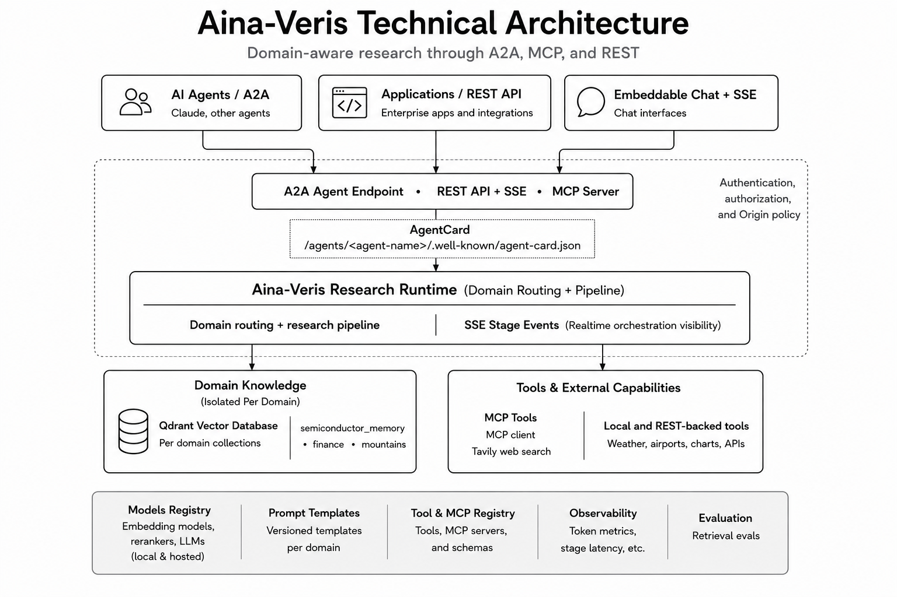

# Architecture

[← Documentation home](index.md)

  

## Runtime boundary

Aina-Veris has one research runtime and several transport surfaces:

- **A2A** publishes a fixed-domain research agent and its AgentCard.
- **MCP** exposes fixed-domain research tools and consumes configured external
  MCP tools such as Tavily.
- **REST and SSE** support applications and browser clients.
- **Embeddable chat** is a small client over the same REST pipeline.

Each public surface reaches the same domain-aware orchestration. It does not
select an arbitrary domain for an A2A or MCP research agent; the server-owned
agent definition fixes that policy.

## Domain knowledge and policy

Each domain can have its own Qdrant collection, corpus, embedding provider,
vector type, retrieval mode, prompts, and model-stage configuration. Global
prompt instructions are inherited unless a domain provides an override.

`prompts/domain_embedding_config.yaml` is the primary domain declaration.
Changing an embedding model, vector shape, chunking policy, or collection
requires re-indexing that domain.

## Research execution

  

The runtime can resolve a follow-up turn, decompose compound questions,
retrieve dense/sparse/hybrid candidates, apply ColBERT and cross-encoder or
hosted reranking, assemble evidence-bearing context, invoke tools, and generate
a cited response. SSE events expose major stages, latency, tokens, and costs.

## Registries and extensibility

- **Domain and model configuration:** `prompts/domain_embedding_config.yaml`
- **Prompt policy:** `prompts/prompt_registry.yaml`
- **Local, REST, and MCP tools:** `prompts/tool_registry.yaml`
- **A2A agents:** `backend/a2a/config.py`

See [A2A](a2a.md), [MCP](mcp_specs.md), and [Tool registry](tool_registry.md).

## Security boundary

Aina-Veris does not include an identity provider, user store, or tenant
authorization model. Authentication, authorization, quotas, rate limits, audit
logging, and public network controls belong at the deployment boundary. See
[Security](security.md) and [Deployment](deployment.md).
